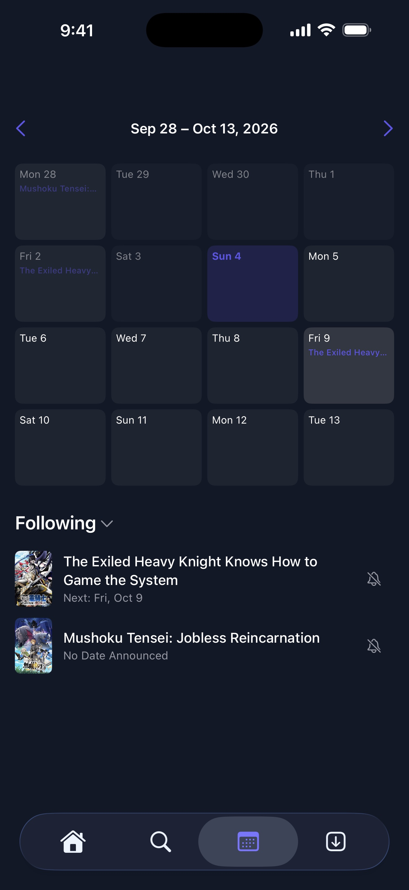

  <h1>SweetFin</h1>
  
  
  
  

  <b>SweetFin</b> is an unofficial video client for the <a href="https://github.com/jellyfin/jellyfin">Jellyfin</a> media server, for iPhone, iPad and Apple TV. It is built on top of <a href="https://github.com/jellyfin/Swiftfin">Swiftfin</a> and plays everything through <b>VLC</b>, with a redesigned interface, watch-together, offline downloads and, paired with its companion server plugin <b>EnhancedFin</b>, discovery, ratings and a release calendar.

## ⚡️ Download

Coming soon to the App Store.

## 📸 Screenshots

  
  
  
  

## ✨ Features

### 🎞️ The Jellyfin client you know

Everything below comes from the Swiftfin foundation SweetFin is built on.

- **Your libraries**: movies, shows, seasons and episodes, collections, cast and crew, with fast A–Z navigation.
- **VLC playback**: plays almost any format, with audio and subtitle track selection, chapters, scrubbing previews (trickplay), adjustable speed and skip intervals.
- **Lock screen and Control Center** playback controls.
- **Several servers and users**, profile pictures and **Quick Connect** sign-in.
- **Server administration** from your phone: activity, users and permissions, active sessions, scheduled tasks.
- **Metadata editing**: edit details and images, identify an item, search and upload subtitles.
- **iPhone, iPad and Apple TV**.

### 🍬 What SweetFin adds

All of this works on any Jellyfin server, no plugin needed.

- **Watch together (SyncPlay)**: create or join a group and play in sync with friends and family, with drift correction down to a few tens of milliseconds.
- **Offline downloads**: save movies, episodes or whole seasons, and watch them without a connection from a dedicated tab.
- **Skip intro, recap and credits**, then jump straight to the next episode, using the media segments of your server.
- **Smarter audio and subtitle lists**: grouped by language, duplicates removed, SDH and audio description shown only if you want them.
- **A redesigned home screen**: a featured carousel, your libraries at a glance, and a "Continue watching" row that resumes playback in one tap.
- **Item pages** with a blurred backdrop, and a season sheet to mark a whole batch of episodes as watched.
- **Themes**: Default, Default Purple and Dark.
- **Direct play only**: the server never has to transcode, ideal for small home servers such as a Raspberry Pi.

### 🧩 Even more with EnhancedFin

[EnhancedFin](https://github.com/gaabsi/EnhancedFin) is a companion **server plugin** for Jellyfin. SweetFin detects it automatically and unlocks:

- **Explore**: browse trending titles and search the whole TMDB catalogue, not just your library.
- **Calendar**: upcoming episodes and releases of the movies and shows you follow.
- **Ratings, watchlist and follows**, kept on your server.
- **TMDB and critics' scores** on item pages.
- **Requests through Seerr** for what you do not have yet.
- **SyncPlay invitations** sent straight to another user's device.

Without the plugin, SweetFin simply hides these features and brings back Jellyfin's native search.

## 🌍 Languages

SweetFin inherits the Jellyfin community translations of Swiftfin. The screens added by SweetFin are available in **English** and **French**.

## 🔒 Privacy

SweetFin collects no data: no account, no analytics, no tracking. See the [privacy policy](PRIVACY.md).

## 🙏 Acknowledgements

SweetFin is built on [Swiftfin](https://github.com/jellyfin/Swiftfin), [Jellyfin](https://jellyfin.org) and [VLC](https://www.videolan.org). Thanks to their contributors.

SweetFin is an independent project, not affiliated with or endorsed by Jellyfin.

## ☕ Support

Keeping SweetFin on the App Store costs a yearly Apple developer fee. If you'd like to help, you can [buy me a coffee](https://buymeacoffee.com/gaabsi).

## 📄 License

SweetFin is distributed under the **Mozilla Public License 2.0**, see [LICENSE.md](LICENSE.md). Code inherited from Swiftfin keeps its original copyright notices (Jellyfin & Jellyfin Contributors).
